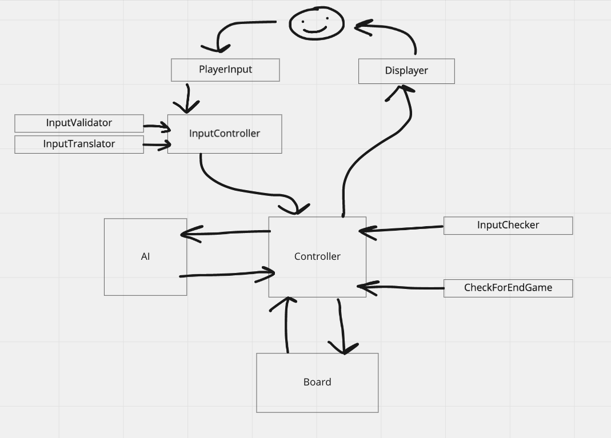

# Tic Tac Toe
This is an exercise in Software Design and Changing Requirements. For more information about the kata, you can check out the [Made Tech website here.](https://learn.madetech.com/sparring/tic-tac-toe/)

## Requirements
Using the discipline of TDD, build a game of tic tac toe.

* The game should allow a human to play against an AI.
  
* The AI should be unbeatable.
  
* The game should have a user interface of some kind.

## Rules

* The game is played on a 3x3 grid.

* You are X, your opponent is O. Players take turns putting their marks in empty squares.

* The first player to get 3 of their marks in a row (up, down, across, or diagonally) is the winner.

* If all 9 squares are full and no player has 3 marks in a row, the game is over.

## Information about the program

We've coded the program in Ruby and are testing it with RSpec. For CI, we're also using Travis.

Our Tic Tac Toe AI implements the Minimax algorithm and will never lose against the user. More information about Minimax can be found [here.](https://www.youtube.com/watch?v=l-hh51ncgDI)

Here is our UML diagram that illustrates how the components of the program interact with each other and the user.

## Setup
Once you have run `git clone` on the files (see Github's instructions), open up your terminal (in iTerm or VSCode), `cd` to the directory where you have cloned the files, then run:

`bundle` 

then 

`ruby lib/main.rb`

Make sure that your font it set to monospace, or the output will look strange.